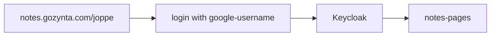

---
{"dg-publish":true,"permalink":"/note-sync/"}
---

## Idea
Publish some #project  and #issue notes for people to read.

URL Would be `notes.gozynta.com/<USER>`

Setup some kind of SSO frontend, in order to keep the notes private.

[GitHub - oleeskild/obsidian-digital-garden](https://github.com/oleeskild/obsidian-digital-garden)

[GitHub - PidgeyL/digitalgarden-selfhosted: Self-Host Obsidian Digital Garden](https://github.com/PidgeyL/digitalgarden-selfhosted)

1. [ ] Setup domain name
2. [ ] Figure out some kind of (hopefully) off the shelf authentication solution. Keycloak?
3. [ ] Note page needs an auth-token

## Experimentation
Hhahaha ok got something basic working, the workflow is a bit sucky. But we will ofc improve on this.

### Setup

This seems like a its a tedious process, but in reality it took me 5m to setup.

This is the obsidian plugin that will push to your git repo: [leeskild/obsidian-digital-garden](https://github.com/oleeskild/obsidian-digital-garden?tab=readme-ov-file)

This is the template: [oleeskild/digitalgarden](https://github.com/oleeskild/digitalgarden?tab=readme-ov-file)

Repo with dockerimage to run it locally: [PidgeyL/digitalgarden-selfhosted](https://github.com/PidgeyL/digitalgarden-selfhosted?tab=readme-ov-file#)

> [!note] These instructions are derived from all the different READMEs
> - [PidgeyL/digitalgarden-selfhosted](https://github.com/PidgeyL/digitalgarden-selfhosted?tab=readme-ov-file#getting-started)
> - [oleeskild/obsidian-digital-garden](https://github.com/oleeskild/obsidian-digital-garden?tab=readme-ov-file#initial-setup)

1. Create your own repo based on this template [oleeskild/digitalgarden](https://github.com/oleeskild/digitalgarden?tab=readme-ov-file) by clicking `Use this template` in the top right corner onto your github repo. (the repo doesn't have to be public)
2. Create an [access token](https://docs.github.com/en/authentication/keeping-your-account-and-data-secure/managing-your-personal-access-tokens#creating-a-fine-grained-personal-access-token) for this repo you've just created. This token will be used by obisidan to push to the repo for  publishing the notes.
3. Install the [leeskild/obsidian-digital-garden](https://github.com/oleeskild/obsidian-digital-garden?tab=readme-ov-file) plugin in obisdian. Go into its settings and paste your `Github token` in there, along with your username and the name of your created repo.
4. You should now be able to publish notes to the repo.
   Create a note for your homepage and add `dg-home: true` and `dg-publish: true`. Press `ctrl+p` and select `Publish Active Note`.
5. Clone [digitalgarden-selfhosted](github.com/PidgeyL/digitalgarden-selfhosted?tab=readme-ov-file#) cd into it and clone your own repo under `site/`. Run `./garden up` and it should be running on `localhost:8080`

