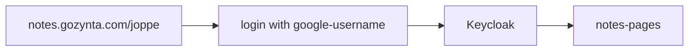

---
{"dg-publish":true,"permalink":"/create-a-link/"}
---

very cool ey

## Idea
Publish some #project  and #issue notes for people to read.

URL Would be `notes.gozynta.com/<USER>`

Setup some kind of SSO frontend, in order to keep the notes private.

[GitHub - oleeskild/obsidian-digital-garden](https://github.com/oleeskild/obsidian-digital-garden)

[GitHub - PidgeyL/digitalgarden-selfhosted: Self-Host Obsidian Digital Garden](https://github.com/PidgeyL/digitalgarden-selfhosted)

1. [ ] Setup domain name
2. [ ] Figure out some kind of (hopefully) off the shelf authentication solution. Keycloak?
3. [ ] Note page needs an auth-token
